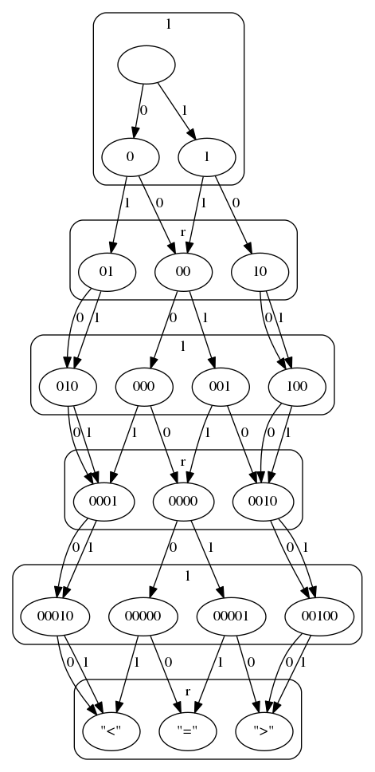
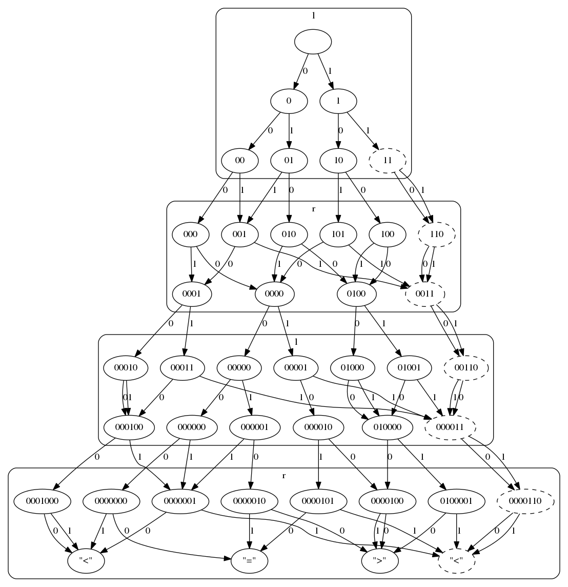

# Tutorial: comparisons

The `cryfsm` tool can be used to convert certain expressions of the Cryptol
language to layered finite state machines, which are suitable for use in matrix
branching program-based obfuscation tools. As a running example, we will take
the program which compares two numbers, outputting one of the strings `"<"`,
`"="`, or `">"`.

## Creating `comparison.cry`

The cryptol expression which computes a single comparison looks like this:

    compare x y = if x < y
        then "<"
        else if x == y
             then "="
             else ">"

Here and below, we will use *italics* to mark text explaining Cryptol syntax
and standard library functions -- feel free to skip this text if you are
already familiar with Cryptol!

*As in many other functional languages, function application is juxtaposition,
so that `f x` means "apply function `f` to argument `x`". The above snippet
defines a new function of two arguments.*

The `cryfsm` tools works only on bit strings, so we will need to tell it how to
parse a string of bits into two numbers. For simplicity, we will assume that
the bits of our numbers come in interleaved, so that the two numbers `abcd` and
`wxyz` would be represented by the bit string `awbxcydz`. We will also
specialize things to three-bit numbers for the moment. So our top-level
function will de-interleave the strings, then hand off the result to `compare`:

    main : [6] -> String 1
    main input = compare x y where
        [x, y] = transpose (split input)

*The first line is a type declaration saying that `main` is a function that
takes bitstrings of length 6 (`[6]`) to bytestrings of length 1 (`String 1`).
The `split` operation groups together adjacent pairs of bits, and `transpose`
is a matrix-transpose operation; together, these two operations put every
even-indexed bit into `x` and every odd-indexed bit into `y`.*

We are almost ready to invoke `cryfsm`; we need two other small pieces which we
will discuss in detail a bit later. For the moment, simply add the above code
and the following two lines to a file named `comparison.cry`:

    valid _ = True
    grouping = ["l", "r", "l", "r", "l", "r"]

*The `_` in `valid _ = True` is called a wildcard. It is valid in patterns
(that is, to the left of an `=`), but not in expressions, so it can be used to
declare that the corresponding function argument will not be used.*

## Visualizing the layered FSM with dot

We can now run the following commands to visualize a finite state machine that
computes the `main` function:

    cryfsm comparison.cry -o comparison.dot
    dot -Tgtk comparison.dot



The node at the top of the diagram with the empty label is the start node for
our state machine. Each node is labeled with the prefix of a bitstring that
leads to that node, and each edge is labeled with a bit as usual for finite
state machines. (For example, following the edges labeled `0`, `0`, `1`, `0`
leads us from the start state to the state labeled `0010`.) Prefixes which
"behave the same" are coalesced into a single state. For example, on the second
layer here, we can see states labeled `00`, `01`, and `10`, but none labeled
`11`. Any bitstring that starts with `00` corresponds to comparing two numbers
whose first bit is both `0`; the remainder of the numbers will decide the
outcome of the comparison. Likewise, the bitstrings that start with `11`
correspond to comparing two numbers whose first bit is both `1`; again, the
remainder of the numbers will decide the outcome of the comparison in exactly
the same way. Using this reasoning, we can give rough intuitions for the three
states in this layer:

* `00`: the two numbers are equal so far, hold off judgment
* `01`: we already know the first number is smaller than the second one
* `10`: we already know the second number is smaller than the first one

It is often possible to give such intuitions for particular states.

In cases like this where many bitstring prefixes have been coalesced into a
single state, `cryfsm` will arbitrarily choose a representative prefix to use
as the state label.

In the last layer, states are labeled instead by simply evaluating `main` on
one of the chosen representative prefixes (which are now a complete input).

We will come back to the meaning of the rounded rectangles surrounding
subgraphs.

## Machine-readable MBP templates

Instead of printing the state machine as a dot-style graph, we can ask for a
machine-readable representation of matrix branching programs by executing the
following command:

    cryfsm comparison.cry -o comparison.json

With a bit of formatting, and some matrices elided for brevity,
`comparison.json` looks like this:

    {"steps":
        [{"0":[[1,0]]
         ,"1":[[0,1]]
         ,"position":"l"
         }
        ,{"0":[[1,0,0]
              ,[0,0,1]
              ]
         ,"1":[[0,1,0]
              ,[1,0,0]
              ]
         ,"position":"r"
         }
        ,{"0":...,"1":...,"position":"l"}
        ,{"0":...,"1":...,"position":"r"}
        ,{"0":...,"1":...,"position":"l"}
        ,{"0":[[1,0,0]
              ,[0,0,1]
              ,[0,1,0]
              ,[0,0,1]
              ]
         ,"1":[[0,1,0]
              ,[1,0,0]
              ,[0,1,0]
              ,[0,0,1]
              ]
         ,"position":"r"
         }
        ]
    ,"outputs":[["\"=\"","\"<\"","\">\""]]
    }

The top-level object has two fields: `steps` gives a way to construct a matrix
branching program for a particular input, and `outputs` tells how to interpret
the result of executing the resulting matrix branching program. We discuss each
in turn.

The `steps` field contains a list of six objects -- one for each bit of input
to our original `main` function. Each object has a field named `position`,
which we will ignore for now, and one field per possible input symbol
containing a matrix. We can construct a matrix branching program for a
particular input by choosing the appropriate matrix from each step; for
example, if we wanted to construct a matrix branching program that asks how
`110` and `001` compare, we would use the input bitstring `101001` to choose
the matrices:

    [[0,1]]

    [[1,0,0]
    ,[0,0,1]
    ]

    [[0,1,0,0]
    ,[0,0,1,0]
    ,[0,0,0,1]
    ]

    [[1,0,0]
    ,[0,0,1]
    ,[0,1,0]
    ,[0,0,1]
    ]

    [[1,0,0,0]
    ,[0,0,1,0]
    ,[0,0,0,1]
    ]

    [[0,1,0]
    ,[1,0,0]
    ,[0,1,0]
    ,[0,0,1]
    ]

(Three of these matrices come from the elided portion of `comparison.json`.)
Multiplying these matrices produces the matrix

    [[0,0,1]]

which, on its own, doesn't necessarily hold much meaning to us.

The `outputs` field tells us how to interpret this result: it gives us a way to
tie positions in the result matrix to outputs of the original `main` function.
Since we have a `1` in row 1, column 3 of the result matrix, we look in row 1,
column 3 of the `outputs` matrix to find `"\">\""`, which means the result
matrix `[[0,0,1]]` represents the cryptol value `">"`.

## Optimization: bit swizzling

For some applications, it is useful to process bits in a different order than
simple interleaving. For example, when computing `L < R`, the order `L0 R0 L1
R1 L2 R2 L3 R3 ...` requires as many matrices as there are inputs; but if we
swap every other pair of bits to the order `(L0 R0) (R1 L1) (L2 R2) (R3 L3)
...` then we can use roughly half as many matrices. This can be a significant
performance win.

To accomodate this use case, `cryfsm` allows grouping of input bits. The
`grouping` declaration in our running example gives us control of this
grouping. Recall that it was defined this way:

    grouping = ["l", "r", "l", "r", "l", "r", "l", "r"]

The meaning of the `grouping` definition is this: each argument to the function
we want to compute is given a name. The `grouping` is a list of these names,
one for each input bit, telling which input the associated bit is determined
by. When multiple adjacent bits are determined by the same input, `cryfsm` will
draw a subgraph grouping around the associated layers of the state machine and
will multiply the associated matrices in the branching program template.

Here's how we could write a modified comparison that uses the more advanced bit
ordering.

    main : [6] -> String 1
    main input = compare x y where
        [x, y] = transpose (reverseEveryOther (split input))
    valid _ = True
    grouping = ["l", "r", "r", "l", "l", "r"]

    reverseEveryOther : {a,b,c} fin b => [a][b]c -> [a][b]c
    reverseEveryOther xs = [f x | f <- cycle [\x -> x, reverse] | x <- xs]
    cycle xs = xs # cycle xs
    compare x y = if x < y
      then "<"
      else if x == y
           then "="
           else ">"

The main changes here are that we have added a call to `reverseEveryOther` into
the "parsing" step of `main`, and the `grouping` constant has been updated to
reflect the new bit ordering. The `compare` function remains unchanged.

*The syntax `[e | x <- ex | y <- ey]` is a **list comprehension**. Using `@`
for list indexing, and naming this comprehension `v`, we can describe the
behavior of the list comprehension like this: the value `v@i` is equal to `e`
where we have replaced any occurrences of `x` in `e` with `ex@i`, and likewise
replaced `y` with `ey@i`. So the list comprehension runs down the two lists
`ex` and `ey` in parallel, binding the values to `x` and `y` and then computing
`e`. The resulting list is as long as the shorter of the two lists `ex` and
`ey`.*

*The `#` function concatenates two lists. So `cycle xs` is an infinite list
obtained by repeating the input list `xs` over and over.*

*The type signature for `reverseEveryOther` is quite involved compared to other
signatures we've seen so far. List types are represented by their length and
contained type, so that `[8]Bit` is a list of length `8` containing `Bit`s, and
`[a][b]c` is a list of length `a` containing lists of length `b` containing
`c`s. The braces in the type indicate that it is polymorphic over lengths `a`
and `b` and contained types `c`. The fat arrow `=>` separates the type from
constraints that instantiations of the polymorphic type variables must satisfy;
`fin n` says that `n` cannot be the distinguished infinite number `inf` -- that
is, that the contained lists must end. This constraint comes from the call to
`reverse`.*

If we run `cryfsm` on the above file to produce a matrix branching program
template, we see something interesting: instead of six steps as before, there
are now only four steps. The price we pay is that the middle two steps are now
associated with twice as many matrices; but if the reduced number of steps also
reduces the multilinearity level needed, this can still be a win.

    {"steps":[{"0":[[1,0]]
              ,"1":[[0,1]]
              ,"position":"l"
              }
             ,{"00":[[1,0,0,0],[0,0,0,1]]
              ,"01":[[0,1,0,0],[0,0,0,1]]
              ,"11":[[0,0,1,0],[0,1,0,0]]
              ,"10":[[0,0,1,0],[1,0,0,0]]
              ,"position":"r"
              }
             ,{"00":[[1,0,0,0],[0,0,0,1],[0,0,0,1],[0,0,1,0]]
              ,"01":[[0,1,0,0],[0,0,0,1],[0,0,0,1],[0,0,1,0]]
              ,"11":[[0,0,1,0],[0,1,0,0],[0,0,0,1],[0,0,1,0]]
              ,"10":[[0,0,1,0],[1,0,0,0],[0,0,0,1],[0,0,1,0]]
              ,"position":"l"
              }
             ,{"0":[[1,0,0],[0,0,1],[0,0,1],[0,1,0]]
              ,"1":[[0,1,0],[1,0,0],[0,0,1],[0,1,0]]
              ,"position":"r"
              }
             ]
    ,"outputs":[["\"=\"","\"<\"","\">\""]]
    }

## Base-3 comparisons

In some applications one may wish to use an alphabet in their state machine
which is not a clean power of two, and so can't be cleanly represented using
only the tools so far. To continue our running example, we might imagine
wanting to represent our numbers in base 3 rather than base 2. (Again, in our
case the tradeoff will be increasing the number of matrices at each step but
potentially decreasing the total number of steps and multilinearity parameter
at the same time.) The `cryfsm` tool offers a way to mark certain input strings
as invalid for this purpose.

To simplify the exposition, we will return to the unoptimized bit ordering (so
just interleaving digits of the numbers we want to compare), and drop from
comparing three-digit numbers to comparing two-digit numbers.

Our encoding of the input numbers will be as follows: if we want to compare the
two digits `ab` to the two digits `xy`, we will first use two bits each to
represent the digits `a`, `b`, `x`, and `y`, then send them to our top-level
function in the order `a0 a1 x0 x1 b0 b1 y0 y1`. Our "parsing" step will look
very similar, but we must now `split` twice: once to group together bits that
represent a single digit, and once to group together digits.

    main : [8] -> String 1
    main in = compare x y where
        [x, y] = transpose (split (split `{each=2} in))

*The syntax ```split `{each=2}``` specializes the `split` function to produce
chunks of length `2`.*

However, there are now some invalid inputs, namely, any which include a `3`
digit somewhere. We can check for this problem this way:

    valid in = [x <= 2 | x <- split `{each=2} in] == ~zero

*The `~` operator is bitwise negation, and `zero` is the all-zero object, so
the `== ~zero` comparison checks that each element of the list is `True`.*

We must also slightly modify `grouping` to reflect the fact that two bits at a
time are determined by each input, thus:

    grouping = ["l", "l", "r", "r", "l", "l", "r", "r"]

As always, the `compare` function is unchanged. When we visualize the state
machine, we will see some states marked with a dotted border to signify that
they are unreachable by valid inputs:



Paths that involve invalid states are omitted when emitting program templates,
so the invalid bit sequence "11" does not appear as a key in any of the steps:

    {"steps":[{"00":[[1,0,0]]
              ,"01":[[0,1,0]]
              ,"10":[[0,0,1]]
              ,"position":"l"
              }
             ,{"00":[[1,0,0],[0,0,1],[0,0,1]]
              ,"01":[[0,1,0],[1,0,0],[0,0,1]]
              ,"10":[[0,1,0],[0,1,0],[1,0,0]]
              ,"position":"r"
              }
             ,{"00":[[1,0,0,0,0],[0,0,0,1,0],[0,0,0,0,1]]
              ,"01":[[0,1,0,0,0],[0,0,0,1,0],[0,0,0,0,1]]
              ,"10":[[0,0,1,0,0],[0,0,0,1,0],[0,0,0,0,1]]
              ,"position":"l"
              }
             ,{"00":[[1,0,0],[0,0,1],[0,0,1],[0,1,0],[0,0,1]]
              ,"01":[[0,1,0],[1,0,0],[0,0,1],[0,1,0],[0,0,1]]
              ,"10":[[0,1,0],[0,1,0],[1,0,0],[0,1,0],[0,0,1]]
              ,"position":"r"
              }
             ]
    ,"outputs":[["\"=\"","\"<\"","\">\""]]
    }

# Flag reference

You may pass any number (including 0) of cryptol modules to `cryfsm`. It also
recognizes the following flags:

`-h` or `--help`: show a brief help text

`-e EXPR`: Specify which function to generate a state machine for. The type of
the associated `EXPR` should be `[n] -> a` for some finite number `n` and
comparable type `a` (i.e. `(fin n, Cmp a)` should hold). Defaults to `main`.

`-v EXPR`: Specify which inputs are valid. The type of the associated `EXPR`
should be `[n] -> Bit` for the same `n` as in the type of the expression given
to `-e`. It is recommended that this function be kept relatively simple and
local; complicated expressions here may result in many spurious states being
generated to keep track of whether we must transition to an invalid state.
Defaults to `valid`.

`-g EXPR`: Specify how input bits should be grouped when producing the program
template. The `EXPR` can be either a cryptol expression or a JSON object; in
either case, it should be a list of strings. Any adjacent elements with the
same string are grouped together. To ease usage with obfuscation tasks, you may
also pass `-g #` to get a grouping which contains string representations of the
numbers `0` to `n-1`, where `n` is as in the type of the expression given to
`-e`. Defaults to `grouping`.

`-o FILE`: Choose a file to output to. If not specified, results are printed
to stdout.

`-f FORMAT`: Choose whether to output as a layered finite state machine
visualization or as a matrix branching program template. The `FORMAT` can be
one of `DOT` for visualizations, `JSON` for templates, or `Guess`. When you
choose `Guess`, it will act as though you had specified `DOT` unless the
filename given to `-o` ends in `.json`. Defaults to `Guess`.

`-s SOLVER`: Choose an SMT solver to use for state machine minimization.
Available choices depend on your build; see `--help` for a complete list.
Defaults to `any`, which will use any solver it can find the installation
location for.

# Output reference

## DOT

The DOT output produces a relatively standard finite state machine diagram with
just a few features worth calling out.

All state machines are layered, meaning that each state can be reached only by
a single, fixed number of symbols from the start state. The consequence of this
is that most states can be ignored when translating a given layer (collection
of edges at the same "depth") to matrix form.

Each state is an equivalence class of binary prefixes of a valid input. A
prefix is considered invalid if all continuations are. Prefixes are considered
equivalent if for every appropriately sized suffix, either one of two
conditions holds:

1. Both full strings are invalid, or
2. Both full strings are valid and the cryptol expression you are converting
   has the same result for both full strings.

States in the last layer are labeled by cryptol values as output by the
function being compiled. All other states are labeled by an arbitrary
representative of their equivalence class.

The value specified for grouping of input bits is used to group together layers
in subgraphs. These subgraphs are labeled with the position name from the
grouping.

## JSON

The top level object contains two keys, `steps` and `outputs`. To run a program
represented by this JSON, one would choose a single matrix from each step,
multiply them together, and use the outputs to connect this result to the
results of the original expression being converted.

The `steps` field contains a list of steps. Each step is an object with one
field named `position`, which contains a free-form string determined by the
grouping expression, and some number of other fields containing a matrix (as a
list of lists of numbers that are always `0` or `1`). All matrices in a single
step have the same size, and the sizes are compatible from step-to-step (the
number of columns in step `i` is the number of rows in step `i+1`). The matrix
fields have bitstring keys that can be used to select the appropriate matrix
during evaluation. (Concatenating the keys chosen from each step should give
the input you want to evaluate the function on.) The matrices in the first step
will always have exactly one row.

If you choose one matrix from each step and compute their product, you will get
a matrix with exactly one `1` in it. Without knowing anything more, this would
not tell you much about the meaning of the evaluation; the `outputs` field
describes the connection between which entry of the result matrix is `1` and
what the original function outputs. Specifically, if there is a `1` in row `r`
and column `c` of the result matrix, then the string in row `r` and column `c`
of `outputs` gives the cryptol value output by the original function.

[//]: # (TODO: too much English, use formatting to make this more vgrep-able)

# Installation

Once you have installed cryptol itself, installing `cryfsm` should be as simple
as typing `cabal install` from within this repository. By default, this places
executables in `~/.cabal/bin`. See [`cryfsm.cabal`](cryfsm.cabal) for a listing
of compatible cryptol versions. There are detailed instructions for building
cryptol from source [in the cryptol
README](https://github.com/GaloisInc/cryptol/#building-cryptol-from-source).
